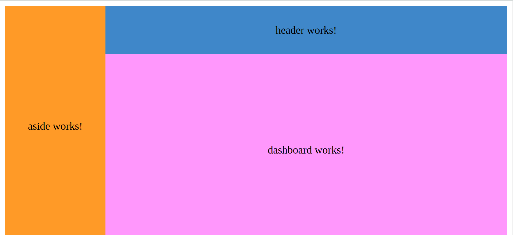

# Acme CRM Angular

## Create components

1. Desde un terminal lanza el siguiente comando:
```terminal
ng new acme-crm --package-manager=pnpm --prefix=acme --style=scss
```

2.  Open your angular.json and replace the builder in test, which should have the value ```@angular-devkit/build-angular:karma``` to ```@angular-devkit/build-angular:jest```.

3.  Install the necessary dependencies via ```pnpm add -D jest @types/jest jest-environment-jsdom```. Locate the tsconfig.spec.json and replace the value jasmine in the property types with jest.

Borra el contenido de los ficheros app.html y app.scss
### Iteration 1: Header
- Create a *header* component to include in any application view.
- Use the component in the AppComponent template:
- Add styles to the component:
  - With SCSS
  - With ng-bootstrap
  - With Angular Material

### Iteration 2: Aside
  - Add the aside menu.

### Iteration 3: Dasboard Component
- Add dashboard and position all the elements to get the following layout

## Image preview 




